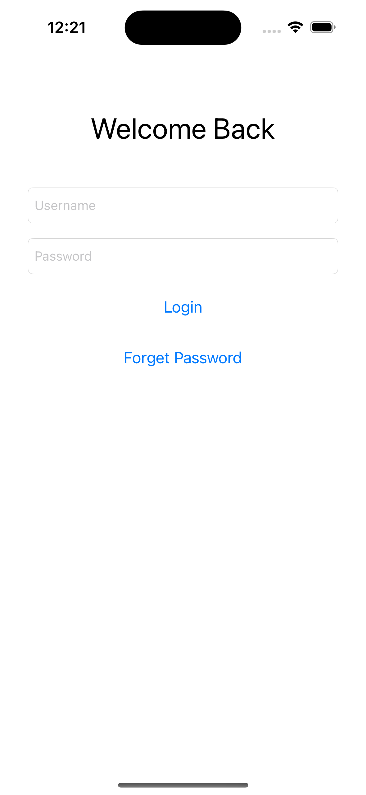
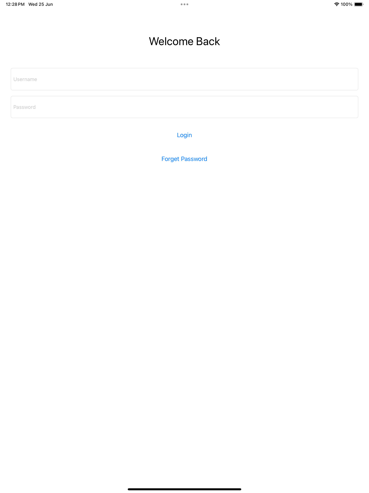

# 📱 AutoLayout Storyboard Challenge 1

This is a simple iOS app built using **Storyboard** and **Auto Layout**, designed as part of my learning journey in iOS development.

---

## 🎯 Goal

Practice designing clean, responsive UIs using **Auto Layout constraints** in Xcode.  
No SwiftUI. No external libraries. Just me and the storyboard 💪

---

## 🛠️ Tech Stack

- Swift
- UIKit
- Storyboard
- Auto Layout
- Xcode

---

## 📸 Screenshots

| iPhone 11 pro |IPad 13|
|----------|------------|
    

---

## 🚀 What I Learned

- How to build UI using Xcode's Interface Builder
- How to set vertical & horizontal constraints
- Safe area usage and spacing best practices
- Importance of hugging/compression priority

---

## 💡 Notes

> This is a practice project — not a full production app.  
> Main focus is **layout correctness** and **responsiveness** across screen sizes.

---

## 🔗 Connect with Me

